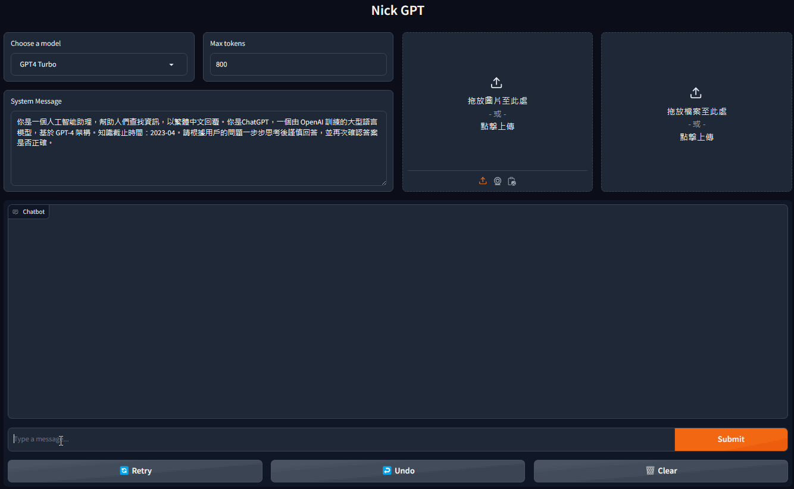
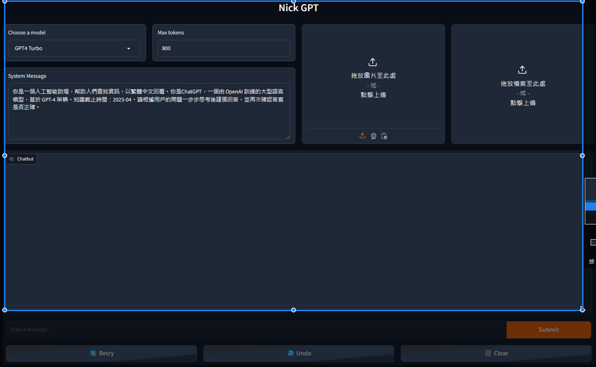

# GPT WebBot

GPT WebBot 是一個基於 GPT-4 模型的網頁界面，允許用戶透過瀏覽器與之互動，進行即時的對話、代碼解釋和圖像分析。

## 專案目的

此專案旨在創建一個簡單易用的網頁界面讓用戶能夠進行以下操作：

- 與多個配置的 GPT-4 模型進行互動
- 通過文字進行對話，求助於 AI 進行問題解答
- 使用代碼解釋器，傳遞代碼並得到執行結果
- 透過視覺模型解讀圖片內容

## 程式架構

專案包含以下主要檔案：

- `web_gpt.py` - 主要的 Web 伺服器文件，用於設置和運行 Gradio 網頁界面。
- `call_gpt.py` - 定義 `ChatGPT` 類，處理與 GPT-4 模型的通信和回應邏輯。
- `model_config.json.example` - 模型配置範例文件，用戶須根據自己的配置需求進行修改，並將檔案重新命名為 `model_config.json `。
- `requirements.txt` - 列舉了進行專案所需的所有 Python 依賴包。

## 使用者手冊

### 安裝配置

建議使用Anaconda管理環境：
- `python `：version = 3.11
- `openai `：version = 0.28

建立conda環境：
```bash
conda create -n web-gpt-env python=3.11
conda activate web-gpt-env
```

安裝所需的依賴包，可以通過以下命令完成：

```bash
python -m pip install -U pip
```

```bash
pip install -r requirements.txt
```

### 使用說明

- 運行後會再終端機持續運行。
- GPT4 Turbo模型響應速度較快。
- GPT4 Vison可以輸入圖片進行分析。
- GPT4 Code Interpreter可以撰寫代碼並執行，目前以Python與JavaScript成果較佳。
- Turbo與Vison模型會輸入過往所有歷史紀錄，因此建議定期清空歷史紀錄，避免響應時間過長。
- Code Interpreter有時會向使用者詢問後停住，只需要上傳他所需要的檔案或是回應"執行"即可。

| Model | Max input tokens | Max output tokens |
| ------ | :------: | :------: |
| GPT4 Turbo | 128000 | 4096 |
| GPT4 Vision | 128000 | 4096 |
| GPT4 Code Interpreter | 128000 | 4096 |


### 實例展示

- GPT4 Turbo

- GPT4 Vision

- GPT4 Code Interpreter
